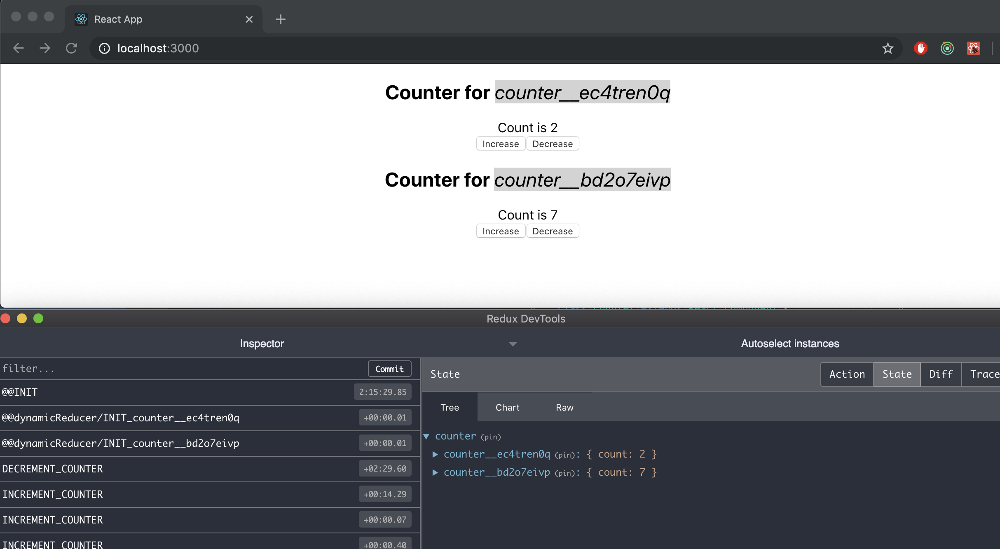

# dynamically-injected-reducer

`dynamically-injected-reducer` is a utility library allowing multiple dynamic copies of a single Redux reducer.

> **_Note:_** _The library is built over [erikras's](https://github.com/erikras) [multireducer](https://github.com/erikras/multireducer) library. Utlizing several functions within the multireducer library._

## Possible usage

There may be an instance where you would like for a component to access the same reducer and actions however within it's own unique state. A very rudementary example is that of a single `Counter` component subscribing to the same reducer and action, however having has it's own dedicated state, as shown below.



## API

- [createReducerManager](#createReducerManager)
- [bindActionCreators](#bindActionCreators)
- [withDynamicReducer](#withDynamicReducer)

### `createReducerManager(reducers)`

#### Arguments

- `reducers : Object [required]` Base reducer object for your redux store

#### Example

```
// Example of a basic configuration of a redux store

import { createStore } from 'redux';
import { createReducerManager } from 'dynamically-injected-reducer';

let store;

export const configureStore = () => {
  const reducerManager = createReducerManager(reducers);

  store = createStore(reducerManager.reduce);
  store.reducerManager = reducerManager;

  return {
    store
  };
};

```

---

### `bindActionCreators(actions)`

#### Arguments

- `actions : Object [required]` Object with actions you'd like to be bound to dispatch

### Example

```
const mapDispatchToProps = bindActionCreators({
  someAction,
  someOtherAction
});
```

---

### `withDynamicReducer(reducer, key, reducerName)`

#### Arguments

- `reducer : Function [required]` A Redux reducer for which the component will dynamically inject into the store
- `key : String [Optional]` A unique key that will be used to append to the `reducer`'s function name or `reducerName`, which results in the `identifier`. Example `exampleReducer__key`
- `reducerName : String [Optional]` A custom reducer name that will be prepended to the `key` resulting in the `identifier`.

### Example

```
import reducer from '../../reducers/exampleReducer';

export default withDynamicReducer(reducer)(
  connect(
    mapStateToProps,
    mapDispatchToProps
  )(ExampleComponent)
);
```
